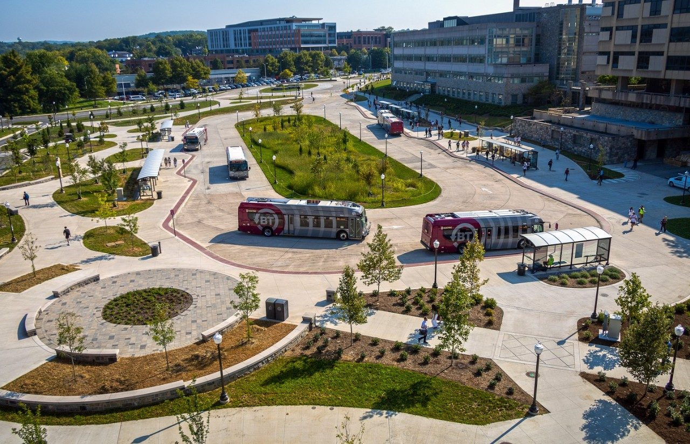

# Getting Around

*Learn how you can roll around campus.*

## Blacksburg Transit

This local bus system will either be your greatest friend or a tolerable enemy; hopefully, by the end of this guide, you'll feel like a professional using the bus.

Blacksburg Transit (BT) serves as free bus transportation around Virginia Tech's campus, Christiansburg, and parts of Montgomery County ([Ridebt.org](https://ridebt.org/)).

By downloading the BT application, you can see the bus routes, know when the next bus is coming, and enjoy wheelchair-accessible rides around campus.

The BT app provides rough-estimates of when buses arrive, but it should not be relied upon. Make sure to arrive at bus stops early, but expect a packed bus around peak hours (8 am to 9 am, 3 pm to 5 pm, 7 pm to 9 pm).

    The bus does not stop at every stop! In order to get off, you can either pull the yellow strings found near the bus windows or press the red button on the hand rail nearest to the bus door.

### Where You Can Go

Once you arrive, you'll be eager to explore every place on campus. Here's a non exhaustive list of places you might want to check out that you can access with the bus system.

Key Locations | Bus Routes*
--- | ---
Kroger (UCB), CVS | UCB, TCP, TCR
Kroger (South Main), Oasis, B&B Theatres | SMS
The Mall, Walmart (Christiansburg) | TTT
Academic & On-Campus Residential areas | HXP, CAS, BMR

**BT bus routes tend to change each semester. Please check out the website or application for up to date information.*

## Journey to Roanoke and NOVA

The [Smart Way Bus](https://www.valleymetro.com/services/smart-way-services) takes riders into the greater Valley Metro Area, most notably the Roanoke Airport. The bus isn't free for students, unlike BT transit, but it is still relatively cheap. See the Smart Way Bus [Fare and Passes page](https://www.valleymetro.com/fares-passes) for information about fares.

The bus runs less on weekends, and never goes to the airport on Sundays, so plan your flights accordingly!

For those that want a direct route from VT to Washington D.C. and don’t mind spending 40 to 60 dollars, look no further than [OurBus](https://www.ourbus.com/?srsltid=AfmBOoqSy-ws-0dfXxGIeRe6tToq0vxyODjGA-t798SmjiUqyM5SQ6hz) and [Megabus](https://us.megabus.com/). OurBus offers transportation to Stadium-Armory in D.C. over the weekends, Thursdays, and Mondays. Megabus goes to Union Station and offers more options throughout the week.

## Parking Pass Roulette

While you don’t need a car during your time at VT, having one makes your life very convenient, especially when you move off campus. Whether you’re trying to find parking for yourself or friends and family, knowing more about parking at VT can help you save money and plan logistics smoothly. 

**When and where can I park for free?**

Weekends are the best times to secure free parking on campus in any Commuter or Faculty lot. From there, if you’re attending a late night event on a weekday, parking on campus will be free from 10 PM to 2 AM. 

**Where can I park on game days?**

Perry Street and North End Center Parking Garages, Ag Quad Lot, and Squires Lot have parking available for 30 dollars on a first-come, first-serve basis. Otherwise, you can park off-campus in [Kent Square Parking Garage](https://en.parkopedia.com/parking/garage/kent_square_garage/24060/blacksburg/?arriving=202603311700&leaving=202603311900) with cheaper rates.

**How much is a parking permit and where can I get one?**

You can expect an annual parking permit to be around 400 to 500 dollars. Permits can be bought online on the Parking Services website or in person at their office. Make sure to bring your Hokie Passport and vehicle registration if you go in-person!

For further information, check out Parking Services' [parking page](https://parking.vt.edu/parking.html) and their [permit page](https://parking.vt.edu/permits.html).