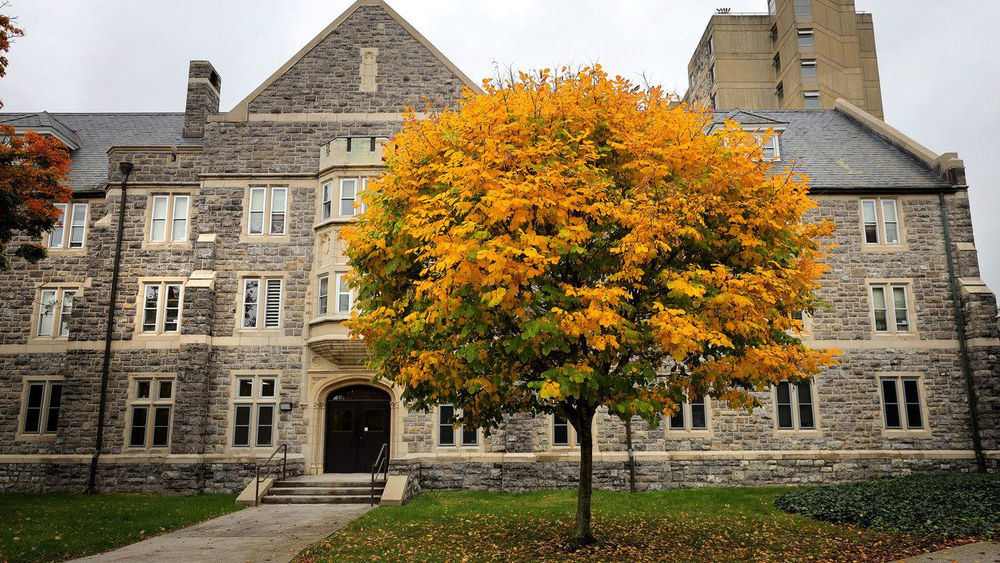

# Getting Comfortable
*Learn how to navigating dorm life*

Virginia Tech houses a whopping 10,000+ students in its many [residence halls](https://housing.vt.edu/experience/YourResidenceHall/HallListing.html). To make the most of your experience living on campus, it's important to know how to navigate your first few weeks in Blacksburg.

## Using Your Hokie Passport
You'll quickly learn that one of your most important tools on campus is your [Hokie Passport](https://www.hokiepassport.vt.edu/), known to seasoned VT students as your **Hokie P**. If your Hokie P isn't working, or you lose it, visit the [Student Services building](https://www.vt.edu/about/locations/buildings/student_services_building.html) for help.

You'll use your Hokie P to get into your residence hall and dorm room, buy food at the dining halls, check in at campus events, and even verify your identity during exams.

> If you get locked out of your room, don't be alarmed! Contact your SL (Student Leader) by stopping by their room or calling the "duty phone" which they'll provide you the number for during orientation.
 
## Roommate Agreement & StarRez Portal
Whether you picked your roommate or decided to try your luck with a "random," problems can arise in such close quarters. The roommate agreement is one way to avoid such problems and ensure a smooth year with your roommate.

To access your roommate agreement, log into your [StarRez portal](https://vt.starrezhousing.com/StarRezPortalX/145A51B9/1/1/Home-Home?UrlToken=7D47662B) and follow the submission instructions. 

The StarRez portal will be your control panel for dorm living. This is where you can access housing forms, request [work orders](https://housing.vt.edu/experience/Halls/work_orders.html), and submit that roommate agreement. 

## Laundry
Laundry is a rite of passage with campus living. In the residence halls, you’ll be sharing laundry machines with your entire building, so make sure you don’t leave your clothes sitting in the dryer for hours (or be at risk of someone throwing your clothes on the floor to use your dryer)!

The laundry machines are pay-per-load through your Hokie Passport balance. To add funds to your Hokie Passport, log in to the [Hokie Spa website](https://selfservice.banner.vt.edu/ssb/twbkwbis.P_GenMenu?name=bmenu.P_MainMnu), click on Hokie Wallet, then navigate to Hokie Passport Services. From there, you can add money to both your Hokie Passport and Dining Dollars accounts. You can also go old school and use quarters for the machines. 

If you'd like to pay for laundry from your phone, you can use [Laundry Web](https://housing.vt.edu/experience/Halls/services_amenities/laundry_rooms.html) or the [Speed Queen app](https://speedqueenlaundry.com/app/). These applications allow you to reserve a washer or dryer, tell you how many machines are in use, and notify you when your laundry is done.

If you don't feel like doing laundry yourself, Virginia Tech also offers a laundry subscription service through their partnership with [University Cleaners](https://universitycleanersva.com/). With this service, your laundry will be washed, folded, and returned to your door within two days. 

## Future Housing
After your first year, you might be itching for some more space. Blacksburg has a ton of options for [off-campus housing](https://offcampus.vt.edu/), from apartment complexes to townhomes.

Leases vary in price depending on amenities and distance from campus, so starting your search early and comparing several options can help you find a place that best fits your budget *and* lifestyle.

Every semester, Virginia Tech hosts an Off-Campus Housing Fair for students to come in search of their future homes. Keep an eye out on [GobblerConnect](https://gobblerconnect.vt.edu/event/11639938) if you’re interested in attending!

If you've enjoyed living in a residence hall and want to return to campus, there are options for you too! Campus housing is not guaranteed after your first year, so students who want to return to the dorms must undergo an [application process](https://housing.vt.edu/contracts/apply/returning_undergrads.html) in late January to live on campus again.