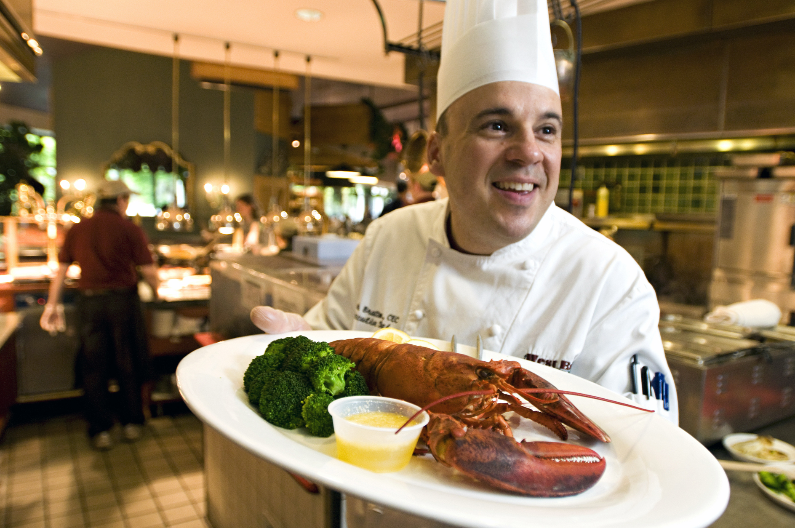
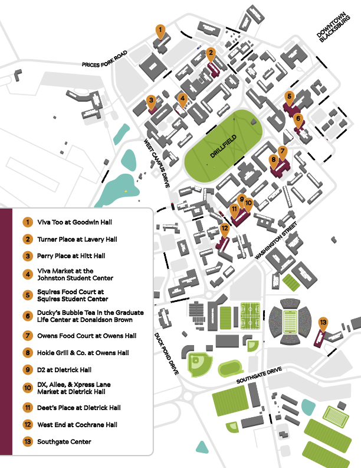

# Getting Food
*A guide to dining on and off campus*

---

If you're a hungry Hokie, consider yourself in luck!

With over 50 dining options and campus food ranked #3 in the United States, you'll have no shortage *amazing* places to eat.

Whether you're looking for a full meal, a quick snack, or a coffee between classes, Virginia Tech offers a wide variety of dining choices across campus.

**Below is a list of major dining locations and the food options available at each.**

## Dining Halls and Food Courts

**Dining Hall** | **Resturants and Shops** | **Type**
--- | --- | ---
**Dietrick Hall** | D2, Deet's Place, DX, Xpress Lane Market, and Futurebites | Buffet, Market, Grab-and-Go, Café
**GLC** | Ducky's at Graduate Life Center | Specialty Drinks
**Hokie Grill at Owens Hall** | Chick-Fil-A, Choolaah, Dunkin' Donuts, Pizza Hut | Food Court, Fast Casual
**Owens Food Court at Owens Hall** | Ciotola, Dish, Franks, Freshens, Garden, Pop's, Sweets, Tazon, Variabowl, Wan | Food Court, Café, Grab-and-Go
**Perry Place at Hitt Hall** | AMP Coffee Bar, Addison's Provisions, Chick-Fil-A, Fresh and Feta, Rambutan, Smoke, Solarex, Trax, Veloce | Food Court, Café, Grab-and-Go
**Squires Food Court at Squires Student Center** | Burger '37, Corner '24 | 
**Turner Place at Lavery Hall** | 1872 Fire Grille, Atomic Pizzeria, Bruegger's Bagels, Dolce e Caffe, Jamba, Origami, Qdoba, Soup Garden | 
**Johnston Student Center** | Viva Market | Market, Grab-and-Go
**Goodwin Hall** | Viva Too | Market, Grab-and-Go
**West End at Cochrane Hall** | Blend, Fighting Gobbler, JP's Chop House, Leaf and Ladle, Rosso, Seven70 | Food Court, Café, Market, Specialty Dining

> Many dining halls feature Grab & Gobble, a grab-and-go option with prepackaged items such as sandwiches, salads, snacks, and drinks.

### Special Menus

Dining Services regularly hosts special events and limited-time menus throughout the semester.

Check the [Dining Services](https://gobblerconnect.vt.edu/organization/dining) website for current events and updates!

## Finding Dining On Campus

But, you might be wondering...

Where do you even start?

After all, Campus is *huge*, and with so many dining options, it can be hard to know where everything is.

Fortunately, Dining Services provides an official dining map each year to help you find your way:

You can also view it on their website: [The 2026 Virginia Tech Dining Map](https://dining.vt.edu/dining_centers.html).

### Coffee
on top of on campus dining, there are so many options off campus! Popular spotsdjkldndso

## Ordering

talk about grubhub here

## Paying for Dining

list meal plans, their prices, who accepts hokie p funds and who doesn't (ex: Citrus cafe in library)

### 2026 Meal Plan Offerings
**Meal Plan** | **Price Per Semester** | **Flex Dollars** | **Meals Per Week**
--- | --- | --- | ---|
**Minor Flex Plan** | $1,559 | $624 | 5-6 Meals |
**Major Flex Plan** | $2,934 | $1,062 | 10 Meals |
**Mega Flex Plan** | $3,147 | $1,275 | 12 Meals |
**Premium Flex Plan** | $3,368 | $1,496 | 14 Meals |
> Note: The Minor Flex Plan is only for students living off-campus.

Brain dump here Choosing a meal plan can feel like a pretty daunting task something something nobody wants to be without money for food with 6 weeks to go in the semester, and for many first-year students this is their first time something something. It's really important to remember that money can always be added to a students account, but it can't be taken out. The funds roll over from fall-spring sem, but not spring-fall, so if you have a ridic amount of money at the end of semester, you wont get it back.

